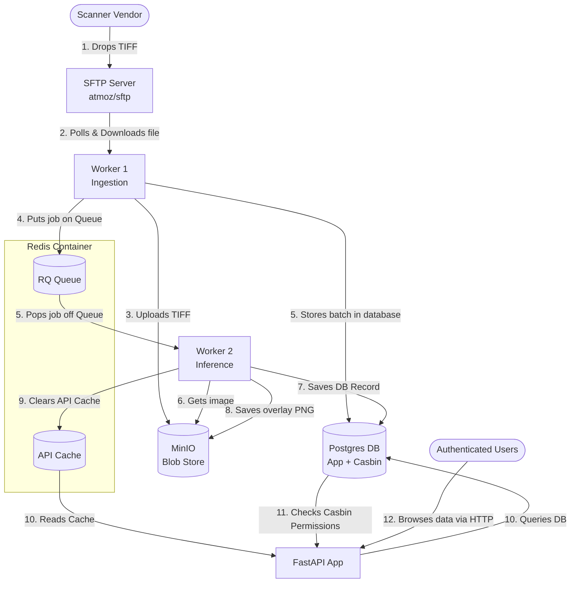

# Document Classifier — Authenticated Service

**Week 6 · AIE Bootcamp · Group 4**

A document classification pipeline secured as an authenticated service. TIFF scans arrive over SFTP, a ConvNeXt Tiny model classifies them into 16 RVL-CDIP categories, and results are served through a role-gated REST API (FastAPI + Casbin RBAC) with a React frontend.

---

## Team

| Person | Name | Owns |
|--------|------|------|
| A | Ali Asfahani | Classifier, model card, golden set |
| B | Sarah Shawraba | API, services, repositories, database |
| C | Mahdi El-Zein | Infra adapters, compose services, SFTP ingestion |
| D | Racha Chamseddine | Auth/RBAC, audit log, inference worker, frontend |

---

## Architecture



---

## Quick start

```sh
git clone <repo-url>
cd document-classifier-authenticated
git lfs pull                  # classifier.pt ~111 MB
cp .env.example .env          # fill in credentials
docker compose up --build
```

| Service | URL |
|---------|-----|
| Frontend | http://localhost:3000 |
| API docs | http://localhost:8000/docs |
| MinIO console | http://localhost:9001 |

For detailed setup, test commands, port reference, and failure recovery see [RUNBOOK.md](readme/RUNBOOK.md).

---

## Classifier

ConvNeXt Tiny trained on a balanced 100k-image RVL-CDIP subset in Google Colab. Classifies by visual layout only — no OCR. Test top-1: **72.6%**, top-5: **93.9%**. Weights stored via Git LFS (~111 MB). Full details in [ARCH.md](readme/ARCH.md).

---

## Auth & roles

JWT (HS256, 60 min) issued by fastapi-users. Signing key loaded from HashiCorp Vault at startup — never from environment variables. Roles enforced by Casbin: `reviewer` → `auditor` → `admin` (admin inherits both). Full security spec in [SECURITY.md](readme/SECURITY.md).

---

## Test results

All suites passed (2026-05-15):

| Suite | Result | Count |
|-------|--------|-------|
| Unit | ✅ | 14 / 14 |
| Integration | ✅ | 7 / 7 |
| Golden-set regression | ✅ | 50 / 50 |
| Full-stack smoke | ✅ | 1 / 1 |

Full validation report, raw output, and bugs caught during testing: [final_testing.md](final_testing.md).

---

## Documentation

| File | Contents |
|------|----------|
| [ARCH.md](readme/ARCH.md) | System architecture, data models, workers, classifier, dataset notices |
| [DECISIONS.md](DECISIONS.md) | Decision log — every team member's key choices with reasoning |
| [SECURITY.md](readme/SECURITY.md) | Vault setup, JWT lifecycle, role table, audit log schema, secrets discipline |
| [RUNBOOK.md](readme/RUNBOOK.md) | Startup, teardown, test commands, port reference, failure recovery |
| [COLLABORATION.md](readme/COLLABORATION.md) | Team ownership, layer rules, git workflow, PR process, review checklist |
| [final_testing.md](final_testing.md) | End-to-end validation report with raw test output |

---

Submission tag: `v0.1.0-week6`
